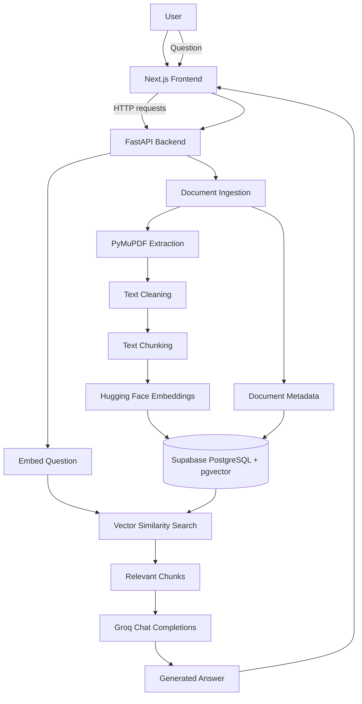
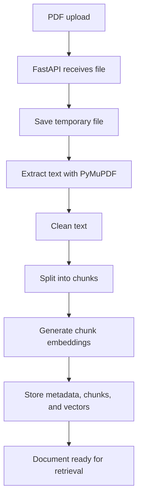
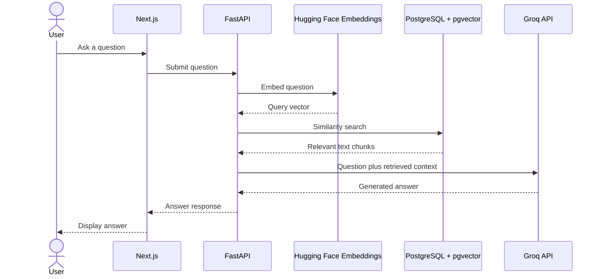
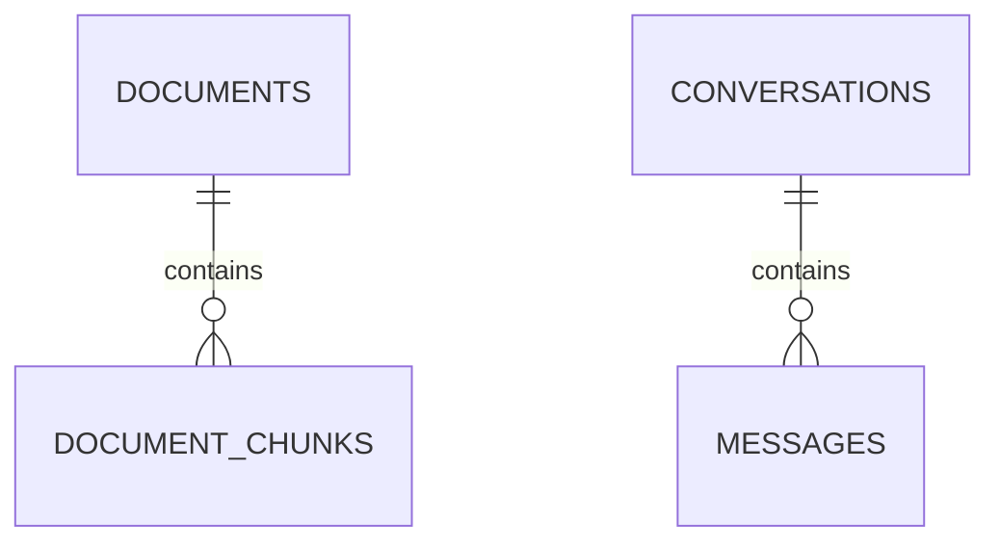
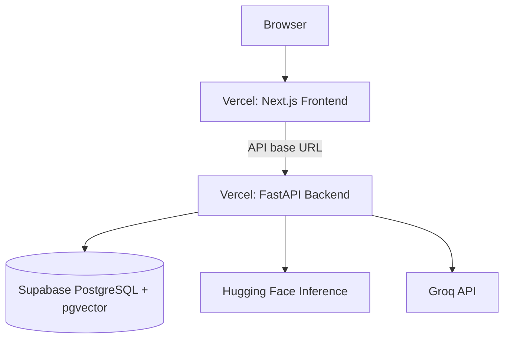

# DocuMind AI — Intelligent Document Intelligence Platform

> An AI-powered document intelligence application that lets users upload PDFs, search their content semantically, and ask questions in natural language.

**Repository:** [Rohan1510-dotcom/documind-ai](https://github.com/Rohan1510-dotcom/documind-ai)

## Table of Contents
- [Overview](#overview)
- [Features](#features)
- [Architecture](#architecture)
- [Technology Stack](#technology-stack)
- [Document Ingestion Pipeline](#document-ingestion-pipeline)
- [RAG Question-Answering Workflow](#rag-question-answering-workflow)
- [Database Design](#database-design)
- [Project Structure](#project-structure)
- [Environment Variables](#environment-variables)
- [Local Setup](#local-setup)
- [Deployment](#deployment)
- [Limitations and Security](#limitations-and-security)
- [Future Improvements](#future-improvements)
- [Contributing](#contributing)
- [License](#license)

---

## Overview

DocuMind AI is a full-stack PDF question-answering application. Users upload a document and ask questions in natural language. The backend extracts and cleans the PDF text, splits it into chunks, generates vector embeddings, and stores those chunks in PostgreSQL. When a question is asked, the system retrieves relevant chunks through vector similarity search and passes the context to a Large Language Model (LLM) to generate an answer.

The project demonstrates an end-to-end AI application combining document ingestion, semantic search, retrieval-augmented generation (RAG), API development, database persistence, and a web interface.

## Features

- PDF upload and document management.
- PDF text extraction using PyMuPDF.
- Text cleaning and chunking for retrieval.
- Text embeddings generated through Hugging Face Inference using `sentence-transformers/all-MiniLM-L6-v2`.
- 384-dimensional embedding vectors.
- Semantic similarity search with PostgreSQL and pgvector.
- AI-generated answers through the Groq chat-completions API.
- Document listing and deletion.
- Next.js frontend connected to a FastAPI backend.

> Answers depend on extraction quality, retrieval results, and the LLM. Verify important information against the original document.

## Architecture

### High-level architecture



### Architectural layers

| Layer | Responsibility |
|---|---|
| Frontend | Next.js UI for uploads, document list, and chat/question interaction |
| API | FastAPI routes and orchestration of application workflows |
| Processing | PDF extraction, text cleaning, chunking, and embedding generation |
| Retrieval | Query embedding and pgvector similarity search |
| Generation | Groq API call using the question and retrieved context |
| Persistence | Supabase PostgreSQL for document records, chunks, vectors, and conversation data |
| Hosting | Vercel for separate frontend and backend projects |

### Component responsibilities

**Next.js frontend:** Provides the user interface and sends HTTP requests to the backend using `NEXT_PUBLIC_API_BASE_URL`. It does not directly query PostgreSQL or call the embedding model.

**FastAPI backend:** Receives uploads and questions, invokes processing and AI services, interacts with the database, and returns results to the frontend.

**Embedding service:** Calls the Hugging Face Inference endpoint for `sentence-transformers/all-MiniLM-L6-v2`. Document chunks and user queries use the same embedding model so their vectors are comparable.

**LLM service:** Calls Groq's OpenAI-compatible chat-completions endpoint. The configured model has been `openai/gpt-oss-120b`; this can depend on backend configuration.

**PostgreSQL + pgvector:** Stores structured application data and vector embeddings, and supports similarity search over chunks.

## Technology Stack

### Frontend
- Next.js
- React
- TypeScript
- Tailwind CSS

### Backend
- Python
- FastAPI
- SQLAlchemy
- PyMuPDF
- Requests
- python-dotenv
- python-multipart

### AI and data
- Supabase PostgreSQL
- pgvector
- Hugging Face Inference API
- `sentence-transformers/all-MiniLM-L6-v2`
- Groq API

### Hosting
- Vercel (frontend and backend)
- Supabase (managed PostgreSQL)

## Document Ingestion Pipeline



1. **Upload:** The frontend sends a PDF to the backend.
2. **Temporary file write:** The backend saves the file so the extraction library can read it. The current Vercel setup uses `/tmp`, which is ephemeral.
3. **Extraction:** PyMuPDF extracts text from the PDF. Scanned image-only documents may require OCR, which is not assumed to be included.
4. **Cleaning:** Extracted text is cleaned before being split.
5. **Chunking:** Text is divided into smaller passages. Chunk size and overlap are determined by the implementation.
6. **Embedding:** Each chunk is sent to Hugging Face Inference and represented as a 384-dimensional vector.
7. **Persistence:** Document metadata, text chunks, and vectors are stored in Supabase PostgreSQL with pgvector.

## RAG Question-Answering Workflow

RAG (Retrieval-Augmented Generation) retrieves relevant document passages and provides them as context to an LLM.



### Retrieval
1. The backend receives a question.
2. The embedding service converts it into a vector using the same model used for document chunks.
3. The backend queries pgvector for similar stored chunk vectors.
4. Relevant chunks are returned as context.

### Generation
1. The backend builds a prompt using the question and retrieved passages.
2. It sends the prompt to Groq's chat-completions API.
3. The LLM generates a response.
4. The backend returns the answer to the frontend.

RAG can improve grounding in document content, but it does not guarantee correctness. Retrieval can miss relevant text and the LLM can produce inaccurate answers.

## Database Design

The project uses Supabase PostgreSQL with the pgvector extension. The core tables include:

- **`documents`** — document-level metadata.
- **`document_chunks`** — extracted text chunks and associated embeddings.
- **`conversations`** — conversation/session records.
- **`messages`** — messages associated with conversations.

Conceptual relationships:



This is a conceptual overview, not a complete schema. Confirm actual column names, constraints, and foreign keys in the current database before treating it as a schema reference.

## API and Application Flow

The frontend communicates with FastAPI over HTTP. Main workflows include:

| Workflow | Purpose |
|---|---|
| Upload | Accept a PDF and process its content |
| List documents | Return document records for the UI |
| Delete document | Remove a document and associated records according to backend logic |
| Ask question | Embed query, retrieve relevant chunks, call LLM, and return answer |

Exact endpoint paths and request/response schemas are intentionally not listed here because they should be taken from the current route definitions or FastAPI `/docs` page rather than guessed.

## Project Structure

```text
documind-ai/
├── frontend/
│   ├── app/                  # Next.js App Router
│   ├── components/           # UI components, if present
│   ├── lib/
│   │   └── api.ts            # Frontend API client
│   ├── public/
│   └── package.json
├── backend/
│   ├── app/
│   │   ├── core/             # Configuration
│   │   ├── db/               # Database engine/session
│   │   ├── services/
│   │   │   ├── document_service.py
│   │   │   ├── embedding_service.py
│   │   │   └── llm_service.py
│   │   └── ...               # Routes, models, schemas, etc.
│   ├── requirements.txt
│   └── ...
├── .gitignore
└── README.md
```

This is a high-level map; verify exact folders against the repository.

## Environment Variables

Keep credentials in environment variables. Never commit real secrets.

### Backend: `backend/.env`

```env
DATABASE_URL=your_supabase_postgresql_connection_string
HF_TOKEN=your_hugging_face_token
GROQ_API_KEY=your_groq_api_key
FRONTEND_URL=http://localhost:3000
```

- `DATABASE_URL`: PostgreSQL connection string.
- `HF_TOKEN`: Hugging Face token, if required by the inference endpoint.
- `GROQ_API_KEY`: Groq API key.
- `FRONTEND_URL`: frontend origin used by CORS configuration, if configured.

Use the database URL format expected by the installed PostgreSQL driver and SQLAlchemy setup.

### Frontend: `frontend/.env.local`

```env
NEXT_PUBLIC_API_BASE_URL=http://127.0.0.1:8000
```

For deployment, set this to the backend's base URL, without `/docs` or a specific API route. Variables prefixed with `NEXT_PUBLIC_` are exposed to browser code; never put secrets in them.

## Local Setup

### Prerequisites
- Python
- Node.js and npm
- Supabase PostgreSQL with pgvector enabled
- Hugging Face token if required
- Groq API key

### 1. Clone

```bash
git clone https://github.com/Rohan1510-dotcom/documind-ai.git
cd documind-ai
```

### 2. Backend

```bash
cd backend
python -m venv venv
```

Activate the environment:

**Windows PowerShell**
```powershell
.\venv\Scripts\Activate.ps1
```

**macOS/Linux**
```bash
source venv/bin/activate
```

Install dependencies and configure `backend/.env`:

```bash
pip install -r requirements.txt
```

Run the API from the `backend` directory:

```bash
uvicorn app.main:app --reload
```

API base URL: `http://127.0.0.1:8000`  
Interactive docs: `http://127.0.0.1:8000/docs`

### 3. Frontend

In a separate terminal:

```bash
cd frontend
npm install
```

Create `frontend/.env.local` with:

```env
NEXT_PUBLIC_API_BASE_URL=http://127.0.0.1:8000
```

Start the development server:

```bash
npm run dev
```

Open the local URL printed by Next.js, commonly `http://localhost:3000`.

## Deployment

The deployed architecture uses separate Vercel projects for the frontend and backend, and Supabase for PostgreSQL.



### Frontend project
- Root directory: `frontend`
- Framework: Next.js
- Set `NEXT_PUBLIC_API_BASE_URL` to the backend's deployed base URL.

### Backend project
- Root directory: `backend`
- Configure `DATABASE_URL`, `HF_TOKEN`, `GROQ_API_KEY`, and the frontend origin as required.
- Ensure CORS allows the deployed frontend domain.

### Deployment notes
- Vercel serverless functions have request-size and execution-time limits.
- Filesystem writes are not durable; `/tmp` is temporary.
- Large document processing may exceed serverless limits.
- Hugging Face and Groq have account-specific quotas and rate limits.

## Limitations and Security

### Known limitations
1. **Temporary PDF storage:** Original PDFs saved under `/tmp` may disappear across restarts or instance changes.
2. **OCR:** PyMuPDF text extraction alone does not provide OCR for image-only scanned PDFs.
3. **Provider limits:** Hugging Face and Groq are subject to quotas, rate limits, and service availability.
4. **Serverless constraints:** Large uploads and long-running processing may fail under platform limits.
5. **Answer accuracy:** LLM responses can be incomplete or incorrect; verify important claims against source documents.
6. **Authentication:** Authentication was intentionally skipped in the current version. Do not assume per-user access isolation.
7. **Privacy:** Avoid sensitive or confidential documents until durable storage and access controls are implemented and reviewed.

### Security practices
- Keep `.env` files out of Git.
- Never expose database credentials or AI API keys in frontend code.
- Treat uploaded files and extracted text as untrusted input.
- Before public use, implement authentication, authorization, upload validation, rate limiting, and document ownership checks.
- Configure database and storage permissions carefully.

## Future Improvements

- Store original PDFs in Supabase Storage and keep durable storage paths in the database.
- Add authentication and per-user document access controls.
- Add upload size/type validation and clearer processing states.
- Add OCR for scanned PDFs.
- Improve retrieval with metadata filtering, hybrid search, or reranking.
- Return source passages and page references with answers where possible.
- Move long-running ingestion to background jobs or a worker.
- Add structured logging, error monitoring, and usage tracking.
- Expand tests for ingestion, retrieval, deletion, and failure handling.

## Contributing

1. Fork the repository.
2. Create a feature branch.
3. Make and test your changes.
4. Submit a pull request describing the change.

For bug reports, include reproduction steps and relevant logs. Do not include secrets or private document contents.

## License

No license is specified in this README. Add a `LICENSE` file and update this section before granting others permission to reuse, modify, or distribute the project.
